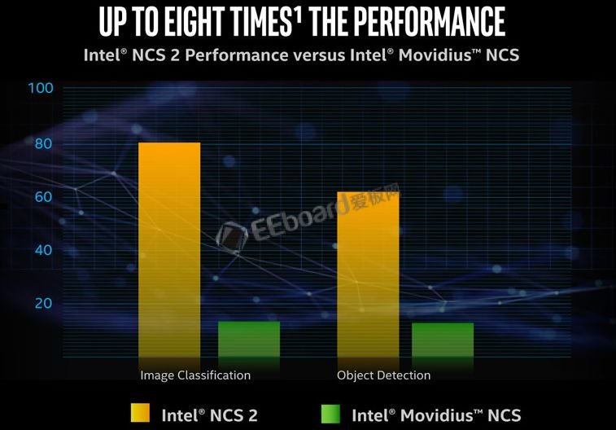

# [OpenVINO](https://github.com/tfzoo/OpenVINO)
####  qitas@qitas.cn

OpenVINO工具包包括英特尔深度学习部署工具包，具有模型优化器和推理引擎，以及面向OpenCV＊和OpenVx＊的优化计算机视觉库。

模型优化可以把开发者基于一些开放的深度学习的框架所开发的网络模型，针对开发者所选用的目标平台进行优化，把这些优化的结果转换成一个中间表示文件，建成IR文件。

下一步，推理引擎会去读取IR文件，然后利用相应的硬件插件把这些IR文件下载到相应目标平台上进行执行，所以这是当前的部署工具套件能够解决的问题。

OpenVINO工具包可通过基于英特尔架构的处理器（CPU）及核显（Integrated GPU）和深度学习加速器（FPGA、Movidius VPU）的深度学习加速芯片，增强视觉系统功能和性能。

### Intel Movidius VPU

之前的Movidius SDK主要做媒体处理，OpenVINO实际上包含了Movidius SDK并进行了功能扩充。

* 增加了对深度学习的支持，其中包含一个深度学习的部署工具套件，里面包括了模型优化器和推理引擎

* 在Movidius SDK基础之上增加了对OpenCV、OpenVX等计算机视觉领域普遍的函数库支持，这些函数库都在英特尔的CPU上做了优化

* 不仅能做编解码的加速，也能做一些视频处理工作

OpenVINO两个优势：

* 第一可以通过一次训练来满足不同的硬件平台，节约成本；
* 第二可以加速产品化的过程，从芯片到做出产品，中间的周期变短了，产品可以更快的上市加速流转。

 

###  www.tfzoo.com
